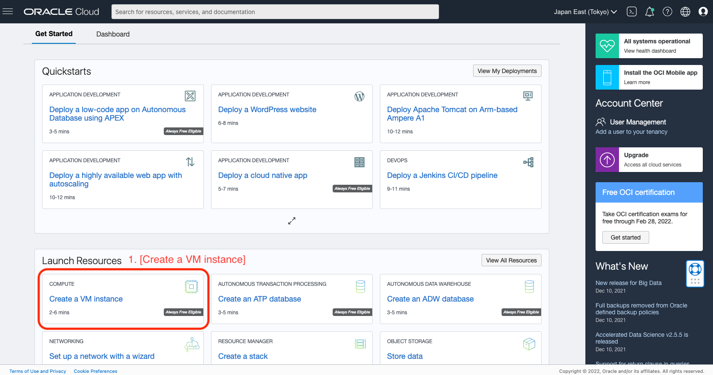
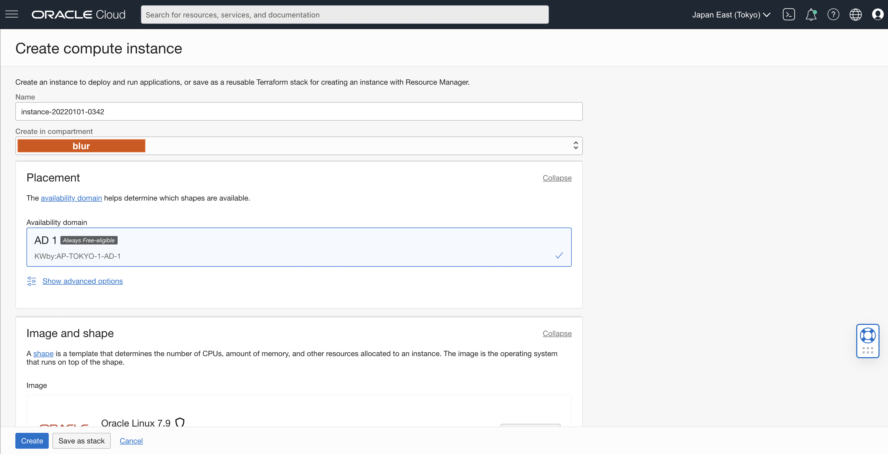
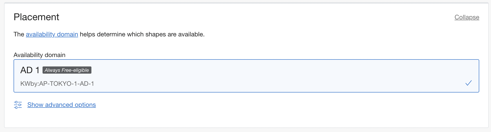
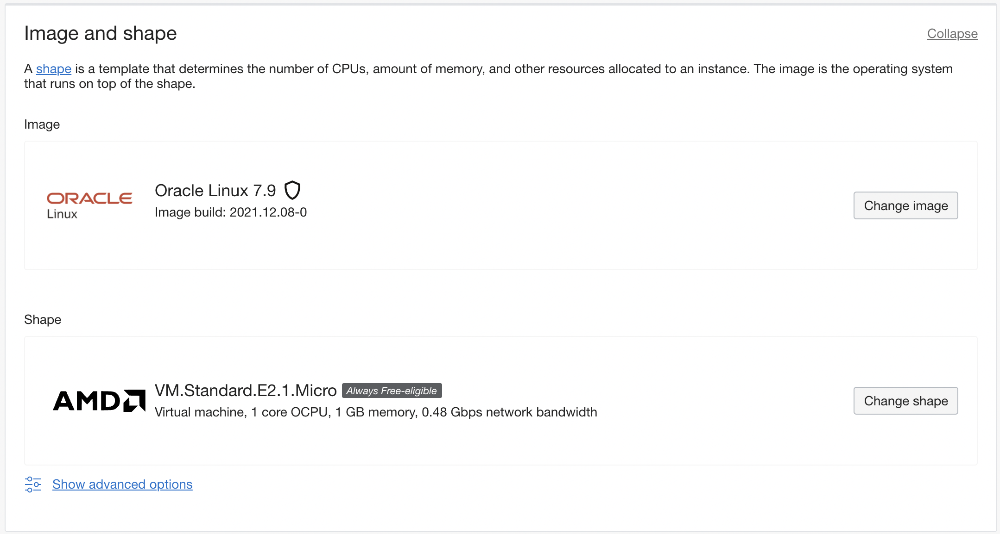
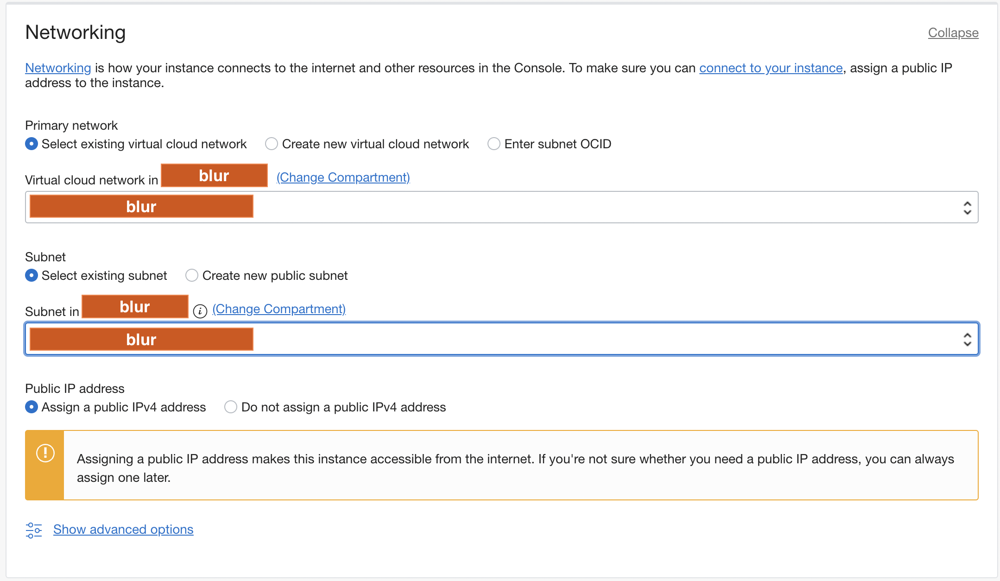
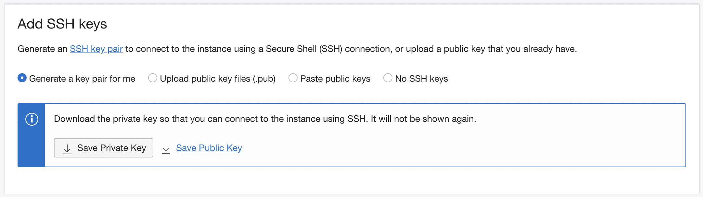
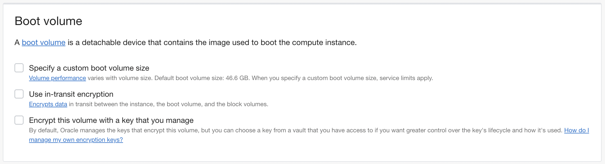
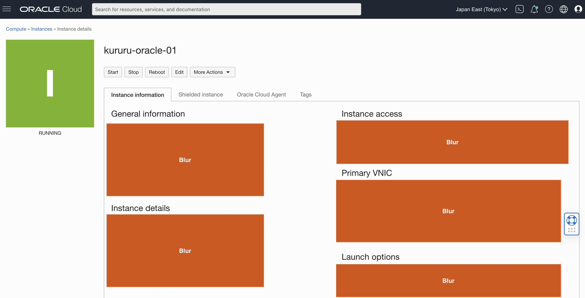

<!--more-->

## GOAL

`OCI Console`을 이용해 `Compute Instance` 생성을 위한 정보와 생성방법에 대해 기술

## PRECONDITION

본 Post의 목적과 OCI내 각 용어는 아래를 참조

🪄 [Oracle Cloud Infrastructure에 대해서](../oci-basics/)

🪄 [Oracle Cloud Infrastructure를 시작하기전에](../oci-before/)

## BEFORE

본 Post를 진행하기에 앞서 이하 사전작업을 진행

- OCI에서 생성할 Compute instance(원격 host)로의 SSH 접속을 위한 `비밀키, 공개키`를 생성

  ssh-keygen을 이용한 비밀키 공개키 쌍을 생성

  ```bash
  # ssh-keygen 실행
  # <key_name>과 <path>는 실행자 환경에 맞춰 설정
  ssh-keygen -t rsa -N "" -b 2048 -C "<key_name>" -f <path>
  ```

  생성된 비밀/공개키 중 `공개키`는 compute instance 생성시에 사용 \
  `비밀키`는 후에 compute instance 접속시에 사용

## CONTENTS

### Compute instance 생성

1. Oracle Cloud Infrastructure 로그인

   https://www.oracle.com/cloud/sign-in.html

2. [Create compute instance] 이동

   OCI-Console내 1[Create a VM instance] 선택 혹은 [Create compute instance](https://cloud.oracle.com/compute/instances/create)로 접속가능

   

   Compute instance 화면

   

3. 생성할 Compute instance 속성 선택

   1. Placement

      해당 Compute instance가 설치되는 장소(`Region`) \
      기본설정으로 OCI account 생성시 설정한 Region이 선택된다

      

      
      🔆 Free tier 회원일 경우, Region은 하나이상 선택불가
      🔆 복수선택 희망시, 유료계정 등록이 필요
      

   2. Image and shape

      해당 Compute instance의 OS image와 shape을 선택

      

      
      🔆 Free tier 회원일 경우, 이용가능한 Image 혹은 Shape의 지정에 제한이 있음
      

   3. Networking

      VCN 및 OCI의 네트워크 관련(subnet, public IP 등) 설정

      

   4. Add SSH keys

      생성후의 compute instance에 접속할때 사용할 SSH Key를 설정 혹은 생성

      본 Post에서는 [Paste public keys]옵션을 사용 \
      사전작업에서 생성한 public key를 [SSH Keys]에 붙여넣기

      

   5. Boot volume

      업데이트 예정

      

   `위 Compute instance 속성 선택을 완료한 경우, 화면 아래 [Create] 버튼 클릭`

### Compute instance 완료

Compute instance의 각각 상세정보가 표시



### Compute instance 접속확인

사전작업에서 생성한 비밀키를 이용해 SSH접속

✨ [SSH 동작방식과 일부 인증방식 설정](../../devops/ssh-authentication/) 중 [ABOUT PUBLIC KEY AUTHENTICATION] 섹터 참고

## REFERENCES

1. [Welcome to Oracle Cloud Infrastructure](https://docs.oracle.com/en-us/iaas/Content/GSG/Concepts/baremetalintro.htm)
2. [Key Concepts and Terminology](https://docs.oracle.com/en-us/iaas/Content/GSG/Concepts/concepts.htm)
