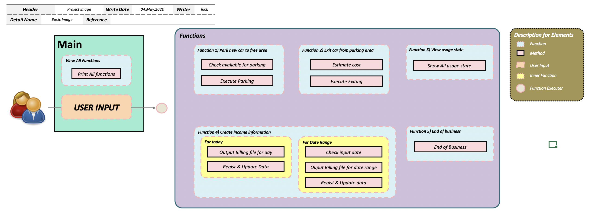
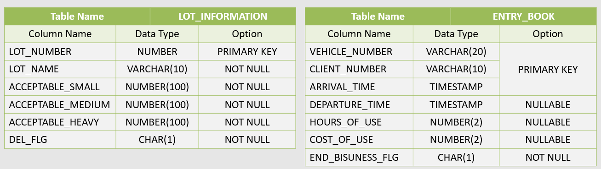
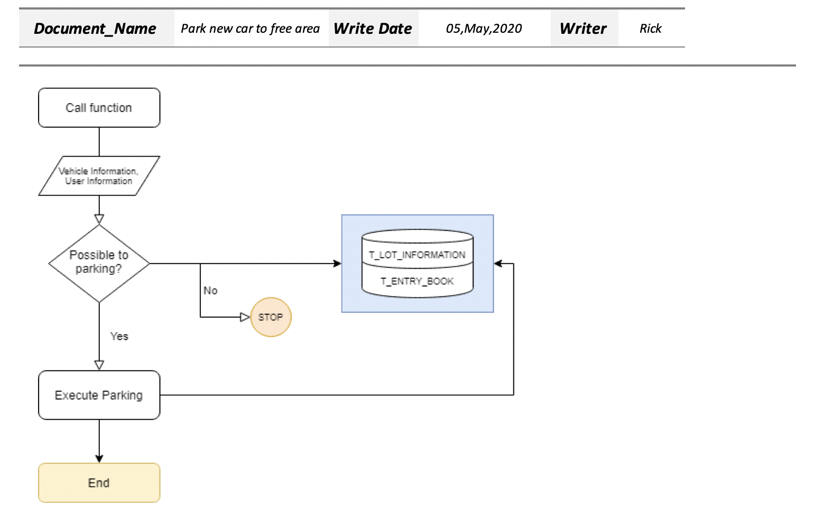
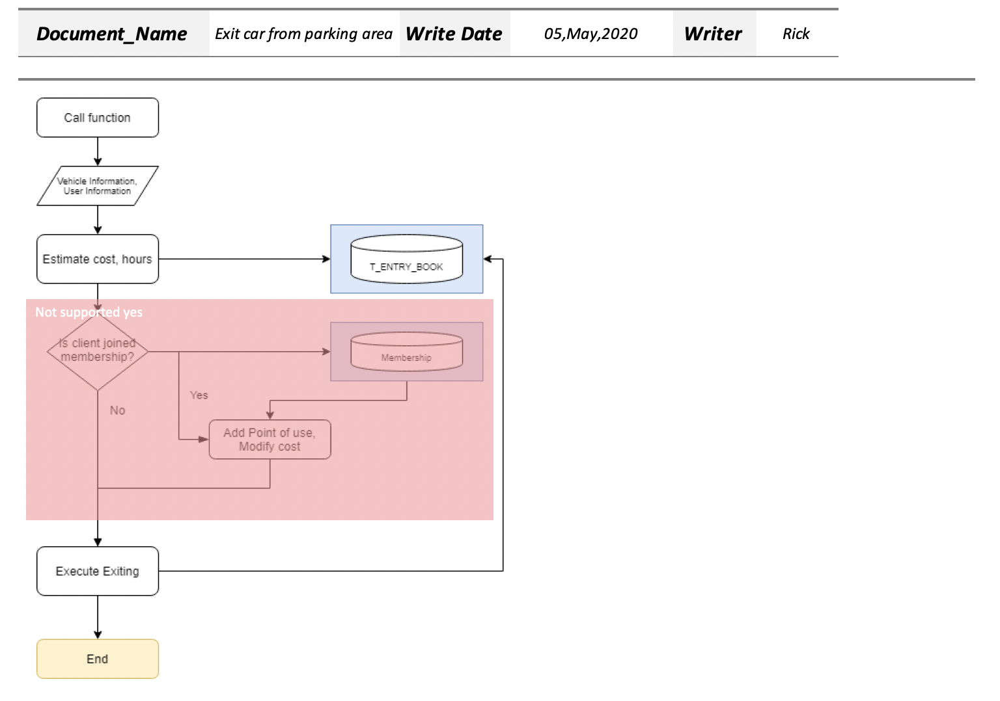
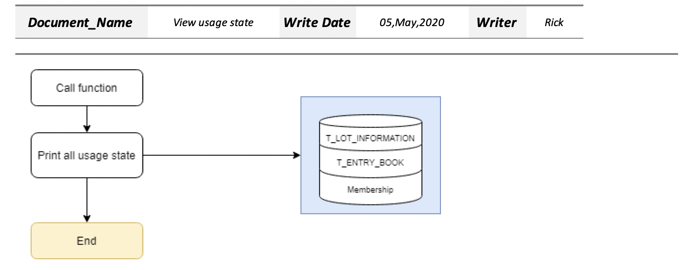
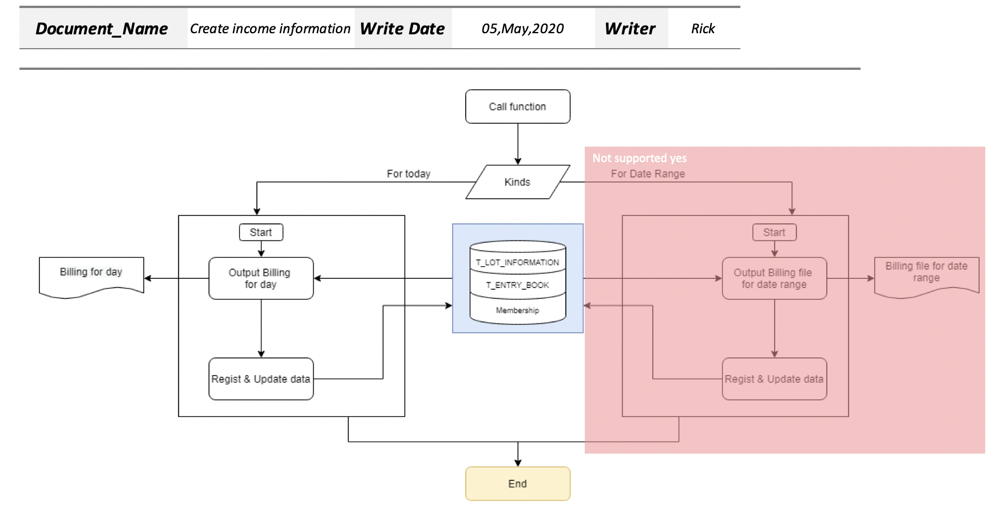
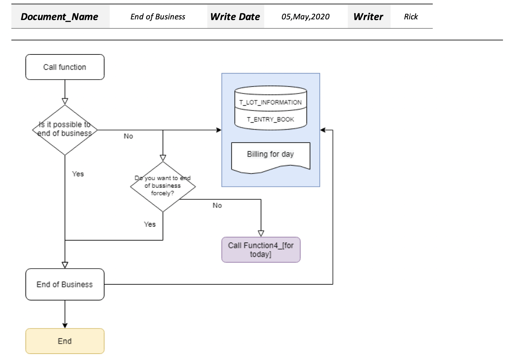

<!--more-->

## BACKGROUND

1. Programming 언어를 배우는 과정에서 기본구문을 이용해 간단한 Project를 진행
2. 새로운 언어를 배우는 경우, Project 주제를 매번 선정해야하는 번거로움이 발생
3. Project 주제 선정, 설계, 코드작성까지 다소 시간이 걸림

## GOAL

Tutorial개념의 Project를 미리 설계 해놓음으로써, 새로운 Programming 언어를 공부할때 불필요한 시간 해소

## PRECONDITION

1. Programming 언어의 기본구문을 전부 활용할 수 있도록 설계할것.
   - All Data types
     integer, string, charcter, date, null type...
   - Array
   - List
   - Map
   - File I/O
     ...
2. Libraries 활용을 최소 한번 이상은 할것. \
   (단, Libraries 활용은 되도록 최소화 하여, 해당 언어의 Native 구문을 최대한 활용)
3. Database를 활용할것.

## CONTENTS

### Design

#### System Flow

#### Database Design

- LOT_INFORMATION: 주차장 정보(Master)

  - LOT_NUMBER: 주차장 일련번호 (`PRIMARY KEY`)
  - LOT_NAME: 주차장 이름 (NOT NULL)
  - ACCEPTABLE_SMALL: 소형차량 주차가능대수 (NOT NULL)
  - ACCEPTABLE_MEDIUM: 중형차량 주차가능대수 (NOT NULL)
  - ACCEPTABLE_HEAVY: 대형차량 주차가능대수 (NOT NULL)
  - DEL_FLG: 삭제Flag (NOT NULL)

- ENTRY_BOOK: 출입대장

  - VEHICLE_NUMBER: 차량번호 (`PRIMARY KEY`)
  - CLIENT_NUMBER: 유저일련번호 (`PRIMARY KEY`)
  - ARRIVAL_TIME: 차량도착시간 (`PRIMARY KEY`)
  - DEPARTURE_TIME: 차량출고시간 (NULLABLE)
  - HOURS_OF_USE: 주차기간 (NULLABLE)
  - DEPARTURE_TIME: 차량출고시간 (NULLABLE)
  - END_BUSINESS_FLG: 매출정산확인Flag (NOT NULL)

### Main Functions

- Park new car to free area (차량입고)

  1. 차량정보 및 유저정보 입력
  2. 차량출입가능여부 확인
  3. 가능한 경우, 차량 입고 \
     불가한 경우, 초기메뉴이동

  
  
  

- Exit car from parking area (차량출고)

  1. 차량정보 및 유저정보 입력
  2. 시간별 금액 산출
  3. 차량 출고

  
  
  

- View usage state (주차장 현황 확인)

  1. 현재 차량크기별 입고현황 출력

  
  
  

- Create income information (하루 매출 정산)

  1. 하루 전체 매출정보를 File로 출력

  
  
  

- End of Business (매장 폐장)

  1. 하루매출정산이 완료되었는지 확인
  2. 완료된경우, 업무종료 \
     미완료인경우, [function -> Create income information] 실행

  
  
  

## SOURCES

- Java: 
- Python: 

## CONCLUSION

사전에 설계한 project 주제를 그대로 채택하여, 다른 언어의 학습에 이용했을때 불필요한 시간이 많이 해소되었다.

## TODO

- 추후 Go language학습을 진행할 예정
