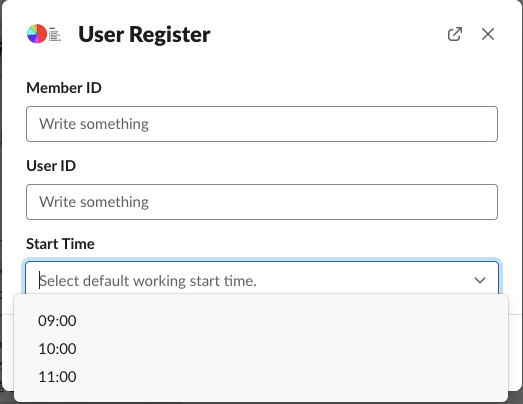
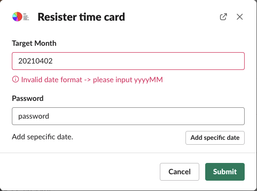
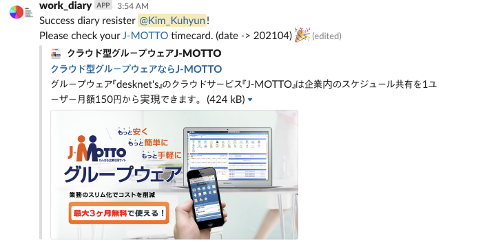

<!--more-->

##### The period of Project: 2021/04/01 - 2021/04/20

## BACKGROUND

- Use external administrative service to company commuting management.
- The service is on web, but some functions are not available in mobile view.
  -> Input commuting function
- Because mobile is not available, there is an inconvenience of accessing the web every time.
- There is a non-business Slack workspace used by employees.

### Input commuting function flow

1. Go to the relevant administrative management system page
2. Login with the assigned account information
3. Go to the employee commuting management page
4. Choose a date and enter the time
5. Submit \
   -> Basically, System dates or before System dates can be registered

## GOAL

Automate repetitive tasks among management system functions

## PRECONDITION

1. The function to be linked to the Slack App is only the input commuting function with the highest frequency of use by employees
   - Automating the function significantly reduces daily discomfort

## SUMMARY

1. Using the command function in Slack, proceed in a conversation method between Slack users and apps
2. Implement a commuting management function using input information after receiving necessary information from a user
3. The actual operation module of the Slack App is built using Python + Flask.
4. Using the Selenium library, manipulate the website

## SPECS

- Server
  Heroku free mode
  : No much access because only 10-20 employees use it
  : It does not require a high-specification server

- Language & Framework
  - Python 3.8.2
  - Framework: Flask
  - 주 Libraries
    - Selenium (For manipulate Web site)
    - gunicorn (For executing in Heroku)
    - slackclient, slackeventsapi (For connecting to Slack)

## FLOW

### Execute slack command (`When user not existed`)

1. Slack Appears modal to register user
   - Required Data: Member ID, User ID, Start Time \
     
2. Submit
   - Save Information to json file \
     Also to check resistered user
   - Announce to user with mention when success to register \
     

### Execute slack command (`When user existed`)

1. Slack Appears modal to register time card
   - Required Data: Target Month(yyyyMM), Password, Add specific data(Not supported) \
     
   - Validation \
     Appear validation error to modal \
     
2. Module runs Selenium in parallel
   - To manipulate web using Selenium
3. Complete process in parallel, post message to user \
   

## CONCLUSION

- Source : <https://github.com/Rick00Kim/Slack_Automator/tree/master/csi_work_diary>

## TODO

- [ ] Save user information to postgresql in heroku
- [ ] Add function; Modify, Delete User

## REFERENCES

- <https://www.heroku.com/>
