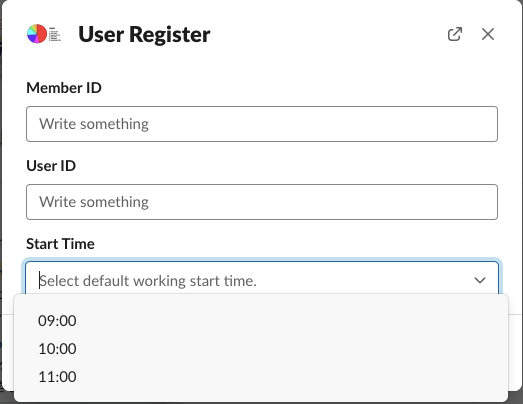
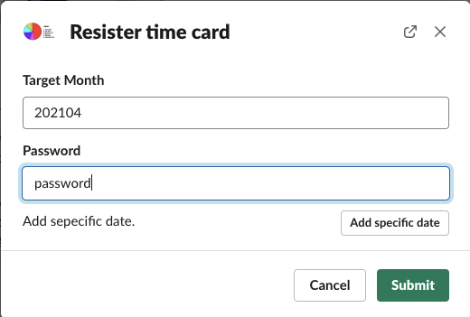
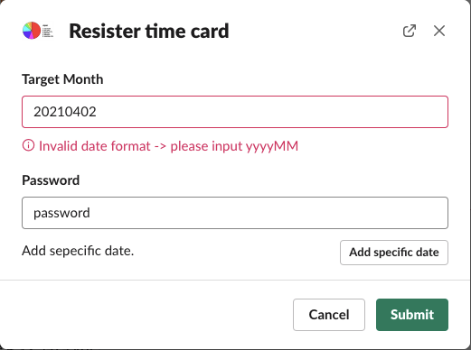
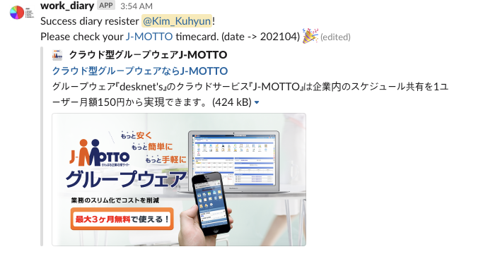

<!--more-->

##### Project 진행 시기: 2021/04/01 - 2021/04/20

## BACKGROUND

- 사내 출퇴근관리는 외부행정서비스를 이용중
- 해당 서비스는 Web 서비스이긴 하나 일부기능이 SP에선 이용불가 \
  -> 출퇴근기록기능
- Mobile이용이 불가하기때문에 매번 Web에 접속해야하는 불편함 발생
- 사원이 이용하는 비업무용 Slack workspace가 존재함

### 사내 행정관리시스템의 동작환경 설명 (출퇴근관리)

1. 해당 행정관리시스템 page로 이동
2. 할당받은 계정정보로 Login
3. 사원 출퇴근관리 page로 이동
4. 등록하고자 하는 일자 선택후, 시간을 입력
5. Submit하여 일자별 근무시간을 등록 \
   -> 기본적으로 System날짜 혹은 System날짜 이전의 근무일만 등록이 가능

## GOAL

사내 행정관리시스템내 일부 조작을 Slack App과 연동함으로 일상내 불편함을 해소

## PRECONDITION

1. Slack App으로 연동할 기능은 사원 이용빈도수가 가장 많은 출퇴근기록기능만으로 함
   - 해당 기능의 자동화를 시행하는것만으로 일상 불편함이 대폭 감소

## SUMMARY

1. Slack내 command기능을 이용하여 Slack 사용자와 App간의 대화방식으로 진행
2. 사용자로부터 필요한 정보를 입력받은 후에 입력정보를 이용하여 출퇴근관리 기능을 구현
3. Slack App의 실제 동작 Module은 Python + Flask를 이용해 구축
4. Selenium library를 이용하여 Web site를 조작

## SPECS

- Server
  Heroku의 free mode 이용
  : Slack이용중인 사원수가 20명 미만이므로 대량 Traffic이 발생하지 않음
  : 고사양 Server를 이용할 이유가 없기때문에 Heroku의 free project를 채용

- Language & Framework
  - Python 3.8.2
  - Framework: Flask
  - 주 Libraries
    - Selenium (Web site 조작 목적)
    - gunicorn (Heroku내 Application 동작 목적)
    - slackclient, slackeventsapi (Slack과의 상호교환 목적)

## FLOW

### Slack command 실행시 (사전등록된 Slack user가 아닌경우)

1. 행정관리시스템의 Login 정보입력 form을 출력
   - 필요 Data: Member ID, User ID, Start Time \
     
2. 정보입력후 submit
   - Slack user ID와 입력정보를 통해 Module내 json file로 저장 \
     해당 json file은 사전등록된 Slack user인지 판별할때 이용
   - 출퇴근관리 Slack room에 성공 Message를 전송 \
     

### Slack command 실행시 (사전등록된 Slack user일경우)

1. 출퇴근관리 등록form을 출력
   - 필요 Data: Target Month(yyyyMM), Password, Add specific data(미지원) \
     
   - 유효성검사 \
     Date형식이 잘못 입력되었을 경우 에러 Response 반환 \
     
2. 입력받은 월에 대한 모든 일자에 출퇴근기록을 실행
   - Selenium을 통한 Web조작 (2-3분 소요)
3. 모든 일자에 대해 입력완료후 출퇴근관리 Slack room에 성공 Message를 전송 \
   

## CONCLUSION

- Source : <https://github.com/Rick00Kim/Slack_Automator/tree/master/csi_work_diary>

## TODO

- [ ] User Information을 저장하는 방식을 json file이 아닌 Heroku에서 제공하는 postgresql로 변경
- [ ] 등록한 User Information을 변경 혹은 삭제 기능을 추가

## REFERENCES

- <https://www.heroku.com/>
