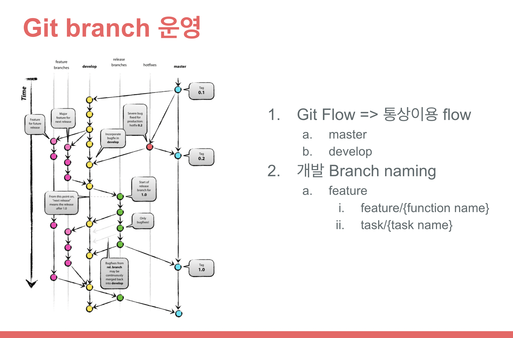

<!--more-->

##### Project 진행 시기: 2021/11/15 - 2021/11/20

## BACKGROUND

- 사내 일부 팀원들간 private project가 진행
- Project는 요구사항, UI Design, 기능설계가 진행중인 상황
- 설계가 완료된 시점에서 바로 개발에 착수할수 있도록 환경구축 및 Module Release pipeline작성에 대한 의뢰를 받음

### 개발 Stacks

- Server: Ubuntu 20.04.02 (사내 운용중)
- Web server: NGINX
- Language & Framework
  1. Frontend
     ReactJS
  2. Backend
     Node.js (express)
  3. Database
     MongoDB
  4. Tools
     - Slack
     - Git
     - Docker
     - docker-compose
     - Jenkins

### project내 역할

- 초기개발환경 구축
- Live server로의 Release용 pipeline 작성 및 테스트

## GOAL

본 project내 역할을 완료

## CONTENTS

### 초기개발환경 구축

1. 개발용 MongoDB Container를 운영서버에 실행

   - Dockerfile생성 [아래 코드는 Template]

   ```
   FROM mongo

    # Environment variables for Initializing DB
    # Mongodb Global variables
    ENV MONGO_INITDB_ROOT_USERNAME 'dev_admin'
    ENV MONGO_INITDB_ROOT_PASSWORD 'dev2140'

    # Development environment variables
    ENV DEV_DATABASE 'dev_web'
    ENV DEV_USERNAME 'dev_manager'
    ENV DEV_PASSWORD 'devPasswd1@#'

    # Copy Initialize file
    COPY ./users_init.sh /docker-entrypoint-initdb.d/

    EXPOSE 27017
   ```

   - Initialize Shell script 생성

     `filename`: users_init.sh

   ```bash
   #!/bin/bash
    set -e

    echo ">>>>>>> trying to create database and users"
    if \
    [ -n "${MONGO_INITDB_ROOT_USERNAME:-}" ] && \
    [ -n "${MONGO_INITDB_ROOT_PASSWORD:-}" ] && \
    [ -n "${DEV_DATABASE:-}" ] && \
    [ -n "${DEV_USERNAME:-}" ] && \
    [ -n "${DEV_PASSWORD:-}" ]; then
    mongo -u $MONGO_INITDB_ROOT_USERNAME -p $MONGO_INITDB_ROOT_PASSWORD <<EOF
    db=db.getSiblingDB('$DEV_DATABASE');
    use $DEV_DATABASE;
    db.createUser({
      user: '$DEV_USERNAME',
      pwd: '$DEV_PASSWORD',
      roles: [{
        role: 'readWrite',
        db: '$DEV_DATABASE'
      }]
    });
    EOF
    else
        echo "Not exists environment variables..."
        exit 403
    fi
   ```

   - 원격 서버에 개발용 DB server 실행

   ```bash
   # docker 컨테이너실행에 필요한 환경변수 설정
   export mongoImageName=aacs_mongo_img
   export mongoContainerName=aacs_mongo_dev

   # docker build
   docker build -f DockerfileForMongo -t ${mongoImageName} .

   # docker run
   docker run --name ${mongoContainerName} -p 27017:27017 --rm -d ${mongoImageName}
   ```

2. Git repository내 Frontend & Backend 모듈 생성

   - Git repository clone

   ```bash
   git clone {project repository URL}
   ```

   - Backend folder 생성 & NodeJS init

   ```bash
   # 폴더 생성
   mkdir backend

   # NodeJS init
   cd backend && npm init
   ```

3. React module 생성

   ```bash
   yarn create react-app frontend
   ```

✨ Github 운영 rules





### Github actions 생성

1. 각 feature branch 개발완료 후, develop branch로 pull request \
   혹은 develop, main branch가 변경된 경우에, npm을 이용한 build 확인을 시행
2. 본 project에서 unit test는 따로 진행하지 않기때문에 build만 확인
3. Project repository내 github actions workflow 작성

   ```yaml
   name: aacs-supporter

   # Controls when the action will run.
   on:
   # Triggers the workflow on push or pull request events but only for the main branch
   push:
      branches: [ develop, main ]
   pull_request:
      branches: [ develop, main ]

   # A workflow run is made up of one or more jobs that can run sequentially or in parallel
   jobs:
   frontend_build_test:
      runs-on: ubuntu-latest
      strategy:
         matrix:
         node-version: [ 12.x, 14.x, 15.x ]

      steps:
         - uses: actions/checkout@v2
         - name: Use Node.js ${{ matrix.node-version }}
         uses: actions/setup-node@v2
         with:
            node-version: ${{ matrix.node-version }}
         - name: npm ci, build and test
         run: |
            cd frontend
            npm ci
            npm run build --if-present
   backend_build_test:
      runs-on: ubuntu-latest
      strategy:
         matrix:
         node-version: [ 12.x, 14.x, 15.x ]

      steps:
         - uses: actions/checkout@v2
         - name: Use Node.js ${{ matrix.node-version }}
         uses: actions/setup-node@v2
         with:
            node-version: ${{ matrix.node-version }}
         - name: npm ci, build and test
         run: |
            cd backend
            npm ci
            npm run build --if-present
   ```

### Live server release용 pipeline생성

본 project는 사내 원격 server에 docker container 실행 \
그리고 사내 원격 server에 운용중인 jenkins가 존재함으로 webhook을 이용한 Jenkins pipeline를 생성

- Update된 모듈의 이행까지의 flow

  1. 해당 repository내 main branch가 갱신
  2. repository내에 설정해놓은 webhook(release pipeline)이 실행
  3. 사내 Jenkins내 release용 pipeline이 실행
     1. repository의 main branch checkout
     2. release용 folder이동 후, docker-compose file을 이용해 build
     3. build된 image를 container run 실행

  🔆 본 project는 아직 개발단계이기때문에, Release pipeline에 대한 Test는 아직 미실시 \
  🔆 통합테스트가 완료된후에 pipeline test 실행예정

## CONCLUSION

- 개발 Team의 의뢰 달성, 현재 개발진행중
- Jenkins Pipeline 생성완료
